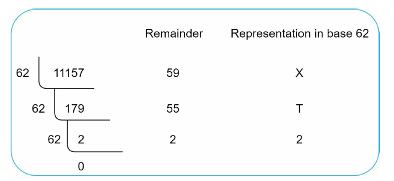

Used
----------------------
1. Postgres
2. Redis

ENDPOINTS
---------------------
Requests:

URI: /api/v1/data/shorten
METHOD: POST

- RequestBody: 
{
  "longUrl": "https://www.amazon.com/Mechanical-Keyboard-Bluetooth-Swappable-Programmable-PC/dp/B0CCP8KYGG/ref=sr_1_3?_encoding=UTF8&content-id=amzn1.sym.12129333-2117-4490-9c17-6d31baf0582a&keywords=gaming%2Bkeyboard&pd_rd_r=5bc2717e-ff98-45a9-b50d-cd207de5e94f&pd_rd_w=zNVYj&pd_rd_wg=vPUiA&pf_rd_p=12129333-2117-4490-9c17-6d31baf0582a&pf_rd_r=H3YX6RJXRZ5V302FX66X&qid=1699342877&sr=8-3&th=1"
}
- Example Response:
{
"shortUrl": "Ybhk345"
}

URI: /{shortUrl}
METHOD: GET

Information
----------------------

- Hashing algo:  Base62
- Unique Id generating: Twitter snowflake
- Bloom filter (https://redis.io/docs/data-types/probabilistic/bloom-filter/)

Information Base 62 algorithm
--------------

